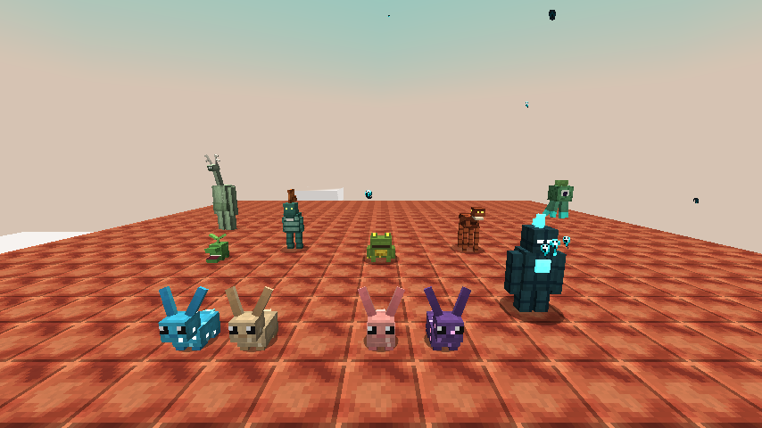
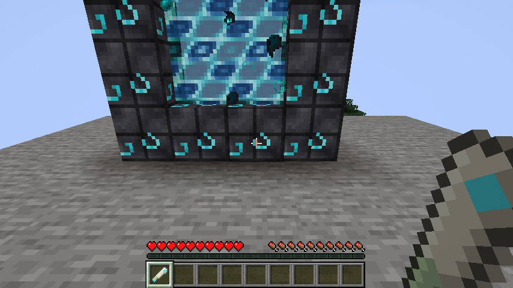
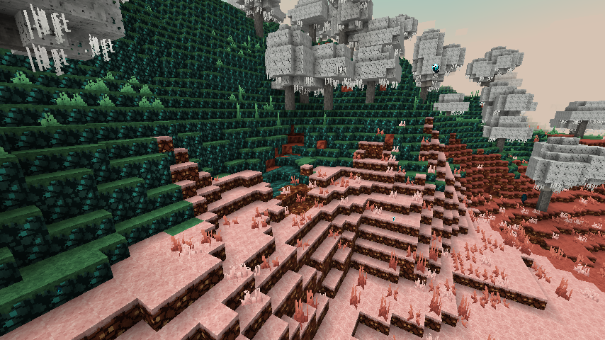
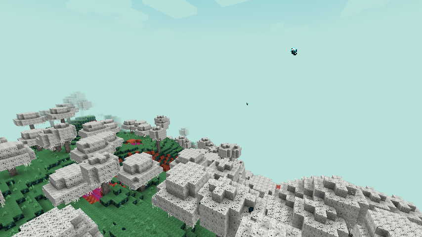
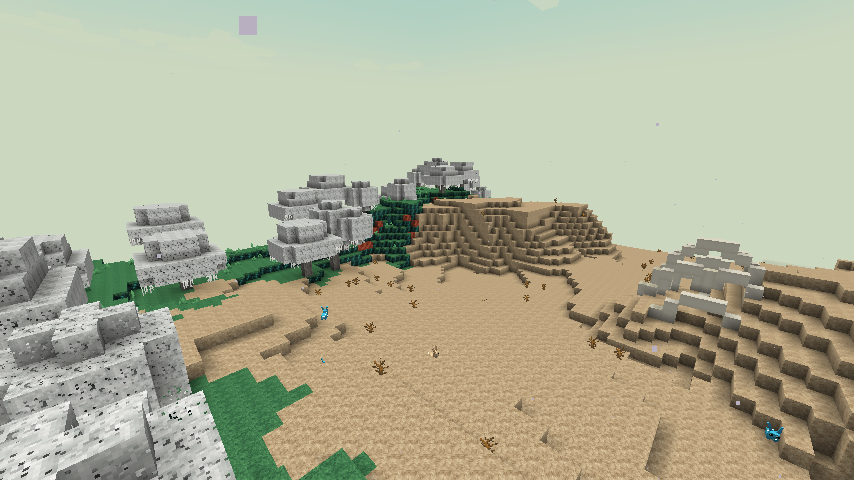
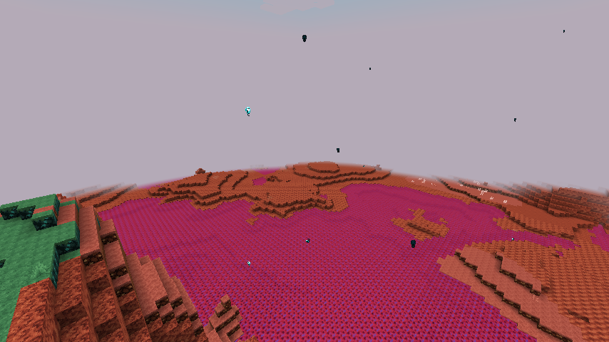
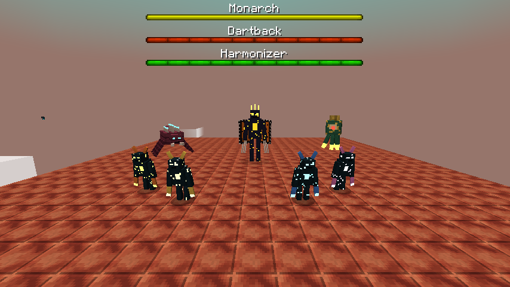
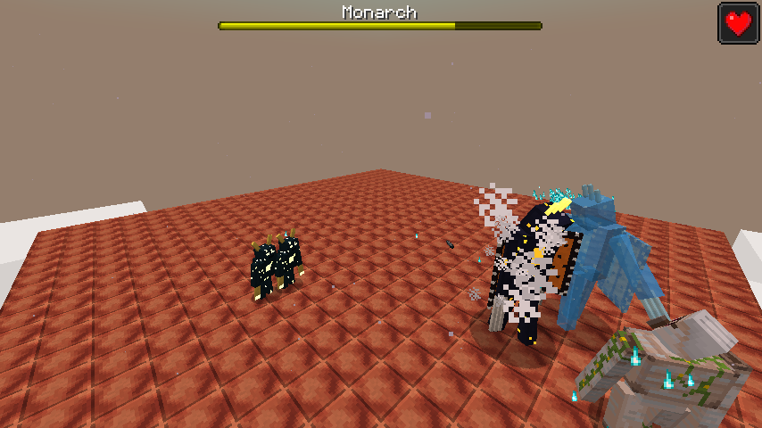

# Dungeons II: The Sift – NeoForge-Mod für Minecraft 1.21.1

Diese Mod bringt **die Sift** – die neue Dimension aus *Minecraft Dungeons II* – samt ihrer Biome, Blöcke,
Kreaturen, Waffen, Artefakte und Rüstungen nach Minecraft Java Edition.

> Fan-Projekt, nicht offiziell und nicht mit Mojang oder Microsoft verbunden. Die Inhalte orientieren sich an den
> bisher bekannten Infos zu Minecraft Dungeons II (Release 29.09.2026). Wo Details unbekannt sind (z. B. genaue
> Werte oder Rezepte), sind sie frei ergänzt.



## Voraussetzungen

| | Version |
|---|---|
| Minecraft | 1.21.1 |
| NeoForge | 21.1.x (getestet mit 21.1.252) |
| Java | 21 |

Die fertige `dungeons2-<version>.jar` in den `mods`-Ordner legen. Ein Build-Artefakt erzeugt GitHub Actions bei
jedem Push (Reiter *Actions* → letzter Lauf → *dungeons2-jar*), oder selbst bauen (siehe unten).

## In die Sift reisen

Die Sift erreicht man – wie in Dungeons II – durch das **Portal des Tiefen Dunkels**:

1. **Horn des Sängers** craften: Ziegenhorn in der Mitte, vier Echoscherben drumherum (oben, unten, links, rechts).
2. Einen geschlossenen Rahmen bauen aus
   * **verstärktem Tiefenschiefer** – der Portalrahmen in der Mitte jeder **Antiken Stadt** funktioniert direkt, oder
   * **resonantem Tiefenschiefer** (8 Tiefenschieferziegel um 1 Echoscherbe = 8 Stück).

   Der Rahmen darf beliebig geformt sein (bis 900 Innenblöcke); ein Netherportal-förmiger 4×5-Rahmen reicht.
3. Mit dem Horn auf den Rahmen rechtsklicken – das Lied der Sänger öffnet das Portal.

Auf der anderen Seite wird automatisch ein Rückportal an der Oberfläche gebaut. In der Luft gespielt,
besänftigt das Horn außerdem Wärter in der Nähe.



## Die Dimension

Eine lebendige Landschaft aus rotem Siftstein, buntem „gesundem“ Sculk, weißen Weiden und Ichor-Seen unter einem
türkisen Himmel, durch den Seelen treiben.

| Biom | Beschreibung |
|---|---|
| **Sängerwiese** (Singer's Meadow) | Rosa/oranges Sculk-Gras, Ichor-Pfützen, vereinzelte Weißweiden. Heimat der Sänger. |
| **Wiegenliedhügel** (Lullaby Hills) | Grüne Sculk-Hügel mit dichten Weißweidenwäldern. Hier ruhen schlafende Echogolems. |
| **Der Panzer** (The Carapace) | Wüste aus Panzersand mit riesigen Knochenbögen – Revier der Sculker. |
| **Ichorschluchten** (Ichor Ravines) | Ichor-Meere und tiefe Schluchten. Hier lauert der Pfeilrücken. |

<p>
 
 
</p>

**Gezeiten der Sift:** Alle 5 Minuten wechselt die Gezeit zwischen *Fluss* (Tempo + Eile), *Gedeihen*
(Regeneration) und *Ausdauer* (Resistenz) – sie wirkt auf alle Spieler in der Dimension.

**Ichor** ist die vielfarbige, zähe Flüssigkeit der Sift. Kreaturen der Oberwelt fangen darin **Seelenfeuer**
(*Seelenbrand*, Schaden ignoriert Rüstung; Feuerresistenz hilft). Bewohner der Sift baden gern darin.
Ichor + Wasser ergibt weinenden Obsidian bzw. Siftstein. Mit einem Eimer lässt er sich einsammeln.

**Ichor-Schmieden:** Gegenstände, die ~5 Sekunden in Ichor treiben, werden umgeschmiedet:

| Hineinwerfen | Ergebnis |
|---|---|
| Dreizack | Spektralspeer |
| Seelensand / Seelenerde | Seelenfragmente |
| Knochenblock | Sifter-Chitin |

### Blöcke
Siftstein (+ Bruch-, polierter, gemeißelter Siftstein, Ziegel, Treppen/Stufen/Mauern), Siftstein-Erze
(Kohle, Eisen, Kupfer, Gold, Diamant), Panzersand und -sandstein, grünes und oranges gesundes Sculk,
Sculk-Grasblöcke in drei Farben, kurzes und hohes Sculk-Gras, das komplette **Weißweiden**-Holzset
(Stämme, Holz, Bretter, Treppen, Stufen, Zaun, Zauntor, Tür, Falltür, Knopf, Druckplatte, Laub, Setzling,
hängende Weißweide), Seelenblock, resonanter Tiefenschiefer.

## Kreaturen

| Kreatur | Verhalten |
|---|---|
| **Blub** | Weicher, hüpfender, hasenartiger Bewohner. Varianten: seelengefüllt (leuchtet), Panzer, Wiesen, Schluchten. Badet in Ichor, lässt sich mit Leuchtbeeren/Süßbeeren züchten. |
| **Sänger** | Großes, sanftes Wesen mit Geweih und langem Hals. Singt, heilt Spieler in der Nähe und besänftigt Wärter. Gib ihm eine **Echoscherbe**, während ein **Seelenblock** in der Nähe steht → er erschafft einen Echogolem für dich. |
| **Echogolem** („Caretaker Golem“) | Begleiter, folgt und beschützt seinen Besitzer, heilt Freunde. Schlafende Golems in den Wiegenliedhügeln mit einem **Seelenblock** wecken. Schleichen + Rechtsklick: sitzen; Echoscherbe heilt. Tanzt, wenn ein Sänger singt. |
| **Setzling** | Kleiner, bissiger Sifter. |
| **Wächter** | Sifter mit Kamm: schüttelt den Kopf und feuert zielsuchende Pfeile, steht danach erschöpft herum. |
| **Bestäuber** | Froschartig: bläht sich auf und spuckt Schleimklumpen, die gelben, verlangsamenden Schleim hinterlassen; Zungenschlag aus der Nähe. |
| **Nister** | Langbeiniger Sifter: galoppiert heran, springt an, weicht Nahkampfangriffen aus. |
| **Spross** | Schwebender Unterstützer: verstärkt Verbündete per Strahl (bevorzugt Bestäuber). Stirbt er, geraten Sifter in der Nähe in **Raserei**. |
| **Harmonisierer** (Mini-Boss) | Riesiger Spross: Brüllen mit Schockwelle + Verstärkung, Strahlen zu allen Verbündeten, Tentakelgriff. |
| **Pfeilrücken** (Mini-Boss) | Sechsbeiniger Koloss der Ichorschluchten: Pfeilsalven, Sturmangriff, ruft Pirscher und Plünderer. Hortet gestohlene Seelenblöcke. |
| **Jäger** | Oranger Sculker, zieht Helden zu sich heran. |
| **Plünderer** | Gelber Sculker, friedlich bis man näher kommt; wirft zielsuchende Seelen, die Seelenfeuer hinterlassen, und springt zurück. |
| **Pirscher** | Blauer Sculker mit langen Klauen: Doppelhieb mit Drehung, Sprungangriff aus der Distanz. |
| **Fallensteller** | Rosa Sculker, sperrt Helden in magische Barrieren. |
| **Monarch** (Boss) | Gewaltiger Sculker mit Schmetterlingsflügeln: Diener beschwören, wirbelnder Sturmangriff, Drehangriff mit 8 Federn, die nach 5 s feuern. Bei 75 % HP erscheint ein **Monarch-Echo** als geisterhafter Klon. Wird mit dem **Monarchenköder** in der Sift beschworen. |




## Ausrüstung

### Waffen
| Waffe | Besonderheit | Herkunft |
|---|---|---|
| Kampfstab | Große Reichweite, starker Rückstoß | Chitin + Weißweidenstamm |
| Riftschlitzer | Jeder 3. Treffer reißt einen Riss auf (Flächenschaden) | Chitin + Enderperle + Stock |
| Spektralspeer | +3 Seelenschaden, große Reichweite | Dreizack in Ichor schmieden |
| Sculkerfluch | +50 % Schaden gegen Sculk-Kreaturen (inkl. Wärter) | Diamantschwert + 4 Sculker-Klauen |
| Sculker-Klauen | Sehr schnell, 3. Kombo-Treffer +6 Schaden | Sculker-Klauen + Monarchenfeder |
| Kakophonisches Hackbeil | Heilt bei jedem Kill | Eisen + Notenblock + Seelenfragment |
| Seelenschnitter | +60 % Erfahrung (Seelen) | Seelenfragmente + Eisen + Stöcke |

### Artefakte (Rechtsklick, mit Abklingzeit)
Echo-Okarina (Schutz vor Fernangriffen), Schutzglockenspiel (Resistenz II für dich und Verbündete),
Demütigendes Horn (wirft Gegner zurück), Verderbte Samen (Gift + Festhalten), Seelenernter (Flächenschaden +
Heilung), Verderbtes Leuchtfeuer (Seelenstrahl, der alles durchbohrt).

### Rüstung
* **Sifter-Rüstung** aus Sifter-Chitin – volles Set: immun gegen Ichor.
* **Wahnsinnige Sifter-Rüstung** = Sifter-Teil + Rasendes Herz + Ichoreimer – volles Set zusätzlich: Raserei
  (Stärke + Tempo) unter halber Gesundheit.

Alle Rezepte sind im Rezeptbuch bzw. über JEI/EMI sichtbar. Die Mod ist komplett auf **Englisch und Deutsch**
übersetzt.

## Selbst bauen

```bash
./gradlew build                 # Jar landet in build/libs/
./gradlew runClient             # Testclient starten
./gradlew runData               # JSON-Daten (Worldgen, Modelle, Rezepte, Loot, Tags, Sprachen) neu erzeugen
python3 tools/gen_all.py        # alle Texturen und Mob-Modelle neu erzeugen (benötigt Pillow + numpy)
```

### Projektaufbau
* `src/main/java/.../registry` – Blöcke, Items, Entities, Effekte, Fluids …
* `src/main/java/.../entity` – alle Kreaturen und ihre KI
* `src/main/java/.../world` – Portal, Teleporter, Ichor, Gezeiten; `world/gen` – Dimension, Biome, Features
* `src/main/java/.../client` – Modell-Loader (`geo`), Animationen und Renderer
* `src/main/java/.../datagen` – Datengeneratoren
* `tools/` – Python-Skripte, die sämtliche Texturen prozedural zeichnen und die Mob-Geometrie
  (`assets/dungeons2/geo/*.json`) zusammen mit passenden UV-Layouts erzeugen.
